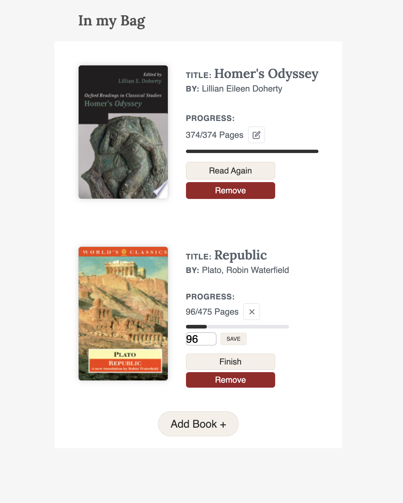

# PagesBag

A personal book management web app built with React. Search for any book via the Open Library API, add it to your shelf, move it to your reading bag, and track your page progress — all without an account or API key.

🌐 **Live demo:** https://mybookbag.netlify.app/


---

## Features

### Search
- Find books using the [Open Library API](https://openlibrary.org/developers/api) — no API key needed
- Smart client-side filtering: results must match your query in the **title, subtitle, or author** — full-text-only noise results are excluded
- Books without a cover, author, or page count are hidden automatically
- Subtitle shown inline with the title
- **Load more** button fetches the next batch on demand
- **Back to top** button appears after scrolling through results

### Shelf
- Save any search result to your shelf with **Add to Shelf**
- Hover over a shelf book to reveal the action overlay:
  - **Add to Bag** — move it to your active reading bag
  - **Edit Book** — opens an in-cover editor for:
    - **Title** and **Author** — editable text fields, pre-filled with current values
    - **Cover** — paste a URL or upload an image from your device (permanent, with confirmation)
    - **Pages** — correct the total page count
  - **Remove** — confirmation overlay before deletion; tick *"Don't ask me again"* to skip future confirmations (preference saved to `localStorage`)

### Bag
- Track your current page with a live progress bar
- Click the current page number to edit it inline
- **Finish** marks the book complete; **Read Again** resets progress to page 1
- **Back to Shelf** returns the book to your shelf without deleting it

### General
- All data persisted to `localStorage` — survives page refreshes, no account needed
- Mobile-friendly with a dedicated search bar for smaller screens

---

## Getting started

### Prerequisites

- Node.js 16+
- npm 8+

### Install & run

```bash
npm install
npm start
```

The app opens at [http://localhost:5173](http://localhost:5173).

No API key or `.env` file is needed — the Open Library API is free and open.

---

## Usage

### Search and add to shelf

Search for any book by title or author. Results are filtered client-side to ensure they genuinely match your query. Click **Add to Shelf** to save a book.


### Edit shelf books

Hover over any shelf book and click **Edit Book** to open the in-cover editor. You can update the title, author, page count, or swap out the cover image.

### Move books between shelf and bag

Hover a shelf book and click **Add to Bag** to start reading it. From the bag, click **Back to Shelf** to return it.



### Track reading progress

Each book in your bag shows your current page and a progress bar. Click the page number to edit it inline. Hit **Finish** when you're done — finished books can be reset with **Read Again**.

---

## Tech stack

| | |
|---|---|
| Framework | [React 18](https://react.dev/) |
| Routing | [React Router v6](https://reactrouter.com/) |
| HTTP | [Axios 1.x](https://axios-http.com/) |
| Data source | [Open Library API](https://openlibrary.org/developers/api) |
| Persistence | `localStorage` |
| Build tool | [Vite 4](https://vitejs.dev/) |
| Testing | [React Testing Library 14](https://testing-library.com/) |

---

## Project structure

```
src/
├── components/
│   ├── App.tsx              # Root component, state & context wiring
│   ├── Header.tsx           # Desktop search bar
│   ├── MobileSearchBox.tsx  # Mobile search bar
│   ├── SearchPage.tsx       # Search results overlay
│   ├── SearchBookList.tsx   # Search result cards + load-more + back-to-top
│   ├── SearchBook.tsx       # Individual search result card
│   ├── ShelfBagWrapper.tsx  # Layout wrapper for shelf + bag
│   ├── Shelf.tsx            # Shelf section
│   ├── ShelfBookList.tsx    # List of shelf book cards
│   ├── BookInShelf.tsx      # Shelf card with hover overlay + in-cover editors
│   ├── Bag.tsx              # Bag section
│   ├── BagBookList.tsx      # List of bag book cards
│   ├── BookInBag.tsx        # Bag card with inline progress editing
│   └── WelcomeMessage.tsx   # Empty-state welcome screen
├── hooks/
│   ├── useSearch.ts         # Open Library fetch, client-side filter, load-more
│   └── useBookBag.ts        # Shelf/bag state, all edit handlers, localStorage
├── types/
│   └── book.ts              # Shared Book interface
├── css/                     # Per-component stylesheets
└── fonts/                   # Rubik font files
```

---

## Running tests

```bash
npm test
```

29 tests across 3 suites — `useSearch`, `useBookBag`, and `App`.
