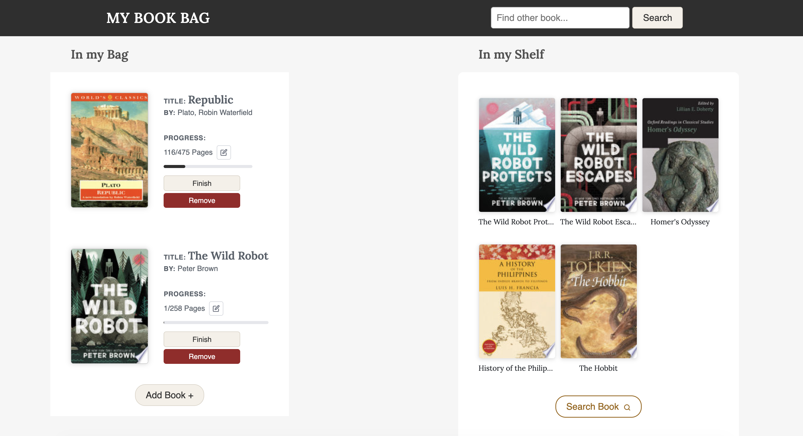
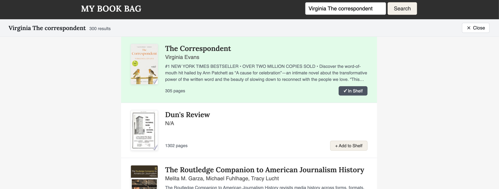

# My Book Bag

A personal book management web app built with React. Search for any book via the Google Books API, add it to your shelf, move it to your reading bag, and track your page progress.

🌐 **Live demo:** https://mybookbag.netlify.app/



---

## Features

- **Search** — find any book using the Google Books API (20 results per page, with pagination)
- **Shelf** — save books you want to read
- **Bag** — move books from your shelf into your active reading bag
- **Progress tracking** — record your current page for each book in your bag and mark it finished
- **Persistent state** — your shelf and bag are saved to `localStorage` so they survive page refreshes
- **Mobile support** — dedicated search box for smaller screens

---

## Getting started

### Prerequisites

- Node.js 16+
- npm 8+

### Install & run

```bash
npm install
npm start
```

The app opens at [http://localhost:5173](http://localhost:5173).

### Optional: Google Books API key

Without an API key the app still works but is subject to Google's unauthenticated rate limits. To add a key:

1. Get a key from the [Google Books API console](https://console.developers.google.com/)
2. Add to the existing `.env` file in the project root:

```
VITE_GOOGLE_BOOKS_API_KEY=your_key_here
```

3. Restart the dev server.

---

## Usage

### Search and add to shelf

Search for any book by title or author. Results come from the Google Books API. Click **Add to Shelf** to save a book.



### Move books between shelf and bag

Click a book on your shelf to move it into your reading bag. From the bag you can move it back to the shelf at any time.


### Track reading progress

Each book in your bag shows your current page and a progress bar. Click the ✏️ pencil icon to edit your current page, hit **SAVE** to confirm, or **Finish** when you're done. Finished books can be reset with **Read Again**.

---

## Tech stack

| | |
|---|---|
| Framework | [React 18](https://react.dev/) |
| Routing | [React Router v6](https://reactrouter.com/) |
| HTTP | [Axios 1.x](https://axios-http.com/) |
| Data source | [Google Books API](https://developers.google.com/books) |
| Persistence | `localStorage` |
| Build tool | [Vite 4](https://vitejs.dev/) |
| Testing | [React Testing Library 14](https://testing-library.com/) |

---

## Project structure

```
src/
├── components/
│   ├── App.tsx              # Root component, state & context
│   ├── Header.tsx           # Desktop search bar
│   ├── MobileSearchBox.tsx  # Mobile search bar
│   ├── SearchPage.tsx       # Search results overlay
│   ├── SearchBookList.tsx   # List of search result cards
│   ├── SearchBook.tsx       # Individual search result card
│   ├── ShelfBagWrapper.tsx  # Layout wrapper for shelf + bag
│   ├── Shelf.tsx            # Shelf section
│   ├── ShelfBookList.tsx    # List of shelf book cards
│   ├── BookInShelf.tsx      # Individual shelf book card
│   ├── Bag.tsx              # Bag section
│   ├── BagBookList.tsx      # List of bag book cards
│   ├── BookInBag.tsx        # Individual bag book card with progress
│   └── WelcomeMessage.tsx   # Empty-state welcome screen
├── hooks/
│   ├── useSearch.ts         # Google Books API fetch, pagination, error state
│   └── useBookBag.ts        # Shelf/bag state and localStorage persistence
├── types/
│   └── book.ts              # Shared Book interface
├── css/                     # Per-component stylesheets
└── fonts/                   # Rubik font files
```

---

## Running tests

```bash
npm test
```

---

*v2.0 redesign (2026) — built with [IBM Bob](https://www.ibm.com/) · [Adélier Classics](https://github.com/sherlockdabe48)*
